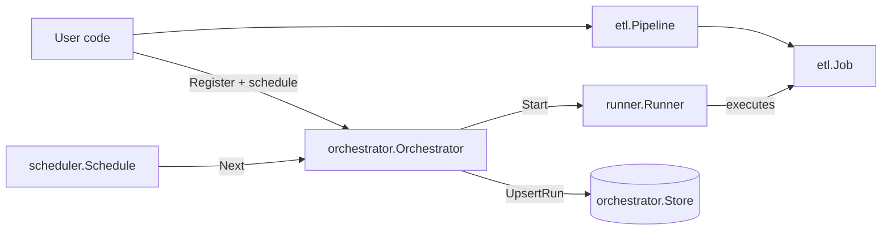

<p align="center"></p>

<p align="center">Lightweight Go framework for small data pipelines. It focuses on simple ETL building blocks and a small orchestration layer for scheduling and running jobs.</p>

<p align="center">
  <a href="https://goreportcard.com/report/github.com/janmarkuslanger/godata"></a>
  <a href="https://github.com/janmarkuslanger/godata/releases"></a>
  <a href="https://github.com/janmarkuslanger/godata/actions"></a>
  <a href="https://github.com/janmarkuslanger/ssgo/archive/refs/heads/main.zip"></a>
</p>

---

## Setup

Requirements:
- Go 1.21+

Install:
- `go get github.com/janmarkuslanger/godata@latest`

Local development:
1) Clone the repo
2) Run `go test ./...`

## Packages

- `etl`: core pipeline primitives (Read -> Step* -> Write) plus hooks and `Job` metadata. No scheduling or concurrency.
- `runner`: executes `etl.Job` asynchronously and keeps run results in memory. No persistence, no scheduling.
- `scheduler`: pure scheduling primitives; computes the next run time.
- `orchestrator`: wires pipelines, schedules, runner, and optional persistence.

## Design

- Small, focused packages so you can use only what you need.
- Pipeline execution is explicit; hooks expose lifecycle events for logging/metrics.
- Scheduling and background execution are opt-in; nothing runs until you start it.
- Persistence is optional; the built-in file store targets single-instance use.

## Architecture

How the pieces fit:
1) Build an `etl.Pipeline` and wrap it in an `etl.Job`.
2) Use `runner.Runner` to execute jobs asynchronously.
3) Use `scheduler.Schedule` to compute future run times.
4) Use `orchestrator.Orchestrator` to register pipelines, start schedules, and persist run metadata.

Building blocks:



Notes:
- `orchestrator.StartScheduler` starts one goroutine per scheduled pipeline; cancel the context to stop.
- `runner` allows overlapping runs; if you need exclusivity, enforce it in your pipeline or schedule.
- `scheduler.Schedule.Next` returning `time.Time{}` stops scheduling for that pipeline.

## API Reference

### Package etl

Build pipelines as `Read -> Step* -> Write`.

Core data types:
- `Record`: `map[string]any` data flowing through the pipeline.
- `Reader`: `func(ctx context.Context) ([]Record, error)` reads a batch.
- `Transform`: `func(ctx context.Context, record Record) (Record, error)` updates a record.
- `Predicate`: `func(ctx context.Context, record Record) (bool, error)` keeps or drops a record.
- `Writer`: `func(ctx context.Context, records []Record) error` writes a batch.

Pipeline builder:
- `New(name string) *Pipeline`: creates a pipeline; `name` must be non-empty.
- `(*Pipeline).Name() string`: returns the pipeline name.
- `(*Pipeline).Read(reader Reader) *Pipeline`: sets the reader; required before `Run`.
- `(*Pipeline).Transform(transform Transform) *Pipeline`: adds a transform step; runs in order.
- `(*Pipeline).Filter(predicate Predicate) *Pipeline`: adds a filter step; `false` drops the record.
- `(*Pipeline).Write(writer Writer) *Pipeline`: sets the writer; required before `Run`.
- `(*Pipeline).Hook(hook PipelineHook) *Pipeline`: sets hooks; nil uses `NoopPipelineHook`.
- `(*Pipeline).Run(ctx context.Context) error`: validates, reads, applies steps, writes; returns wrapped errors.

Job:
- `NewJob(pipeline *Pipeline) (*Job, error)`: creates a job; error if pipeline is nil.
- `(*Job).Hook(hook JobHook) *Job`: sets hooks; nil uses `NoopJobHook`.
- `(*Job).Run(ctx context.Context) error`: runs the pipeline; sets `StartedAt`, `EndedAt`, `Err`.
- `(*Job).Duration() time.Duration`: 0 if not started; otherwise elapsed.
- `Job` fields: `ID` (random), `Pipeline` (pointer), `Name` (pipeline name), `StartedAt`, `EndedAt`, `Err`.

Hooks and info:
- `PipelineInfo`: `PipelineName`.
- `JobInfo`: `JobID`, `PipelineName`.
- `PipelineHook.OnPipelineStart(ctx, info)`: called once before reading.
- `PipelineHook.OnPipelineEnd(ctx, info, err, dur)`: called once after completion.
- `PipelineHook.OnReadStart(ctx, info)`: before the reader runs.
- `PipelineHook.OnReadEnd(ctx, info, records, err, dur)`: after the reader finishes.
- `PipelineHook.OnStepStart(ctx, info, step)`: before each step.
- `PipelineHook.OnStepEnd(ctx, info, step, err, dur)`: after each step.
- `PipelineHook.OnWriteStart(ctx, info, records)`: before the writer runs.
- `PipelineHook.OnWriteEnd(ctx, info, err, dur)`: after the writer finishes.
- `JobHook.OnJobStart(ctx, info)`: called once before the job runs.
- `JobHook.OnJobEnd(ctx, info, err, dur)`: called once after the job finishes.
- `NoopPipelineHook`, `NoopJobHook` are provided for embedding.

Behavior and errors:
- Steps run sequentially for each record; filters may drop records and skip remaining steps.
- Errors are wrapped as `read failed: ...`, `step[N] failed: ...`, `write failed: ...`.
- Hooks receive per-stage durations and record counts.

### Package scheduler

Define when the next run should happen.

Core types:
- `Schedule`: `Next(after time.Time) time.Time` returns the next run time.

Schedules:
- `Interval`: fixed-duration schedule.
- `Every(d time.Duration) Interval`: helper to build an interval schedule.
- `DailyAt`: run at specific times of day (optionally constrained to weekdays).
- `Multi`: combine multiple schedules and run at the earliest next time.

Behavior:
- `Interval.Next` returns `time.Time{}` when `Every <= 0`.
- Returning `time.Time{}` from `Next` stops scheduling.
`DailyAt` details:
- `Times` is a list of `ClockTime{Hour, Minute}` entries (e.g. 02:00 and 14:30).
- `Weekdays` is optional; if set, only those days are eligible.
- `Location` defaults to `time.Local` when nil.
- `Weekdays` applies to all `Times`. Use `Multi` if you need different weekday rules per time.

Examples:

```go
// Every night at 02:00 (local time).
schedule := scheduler.DailyAt{
	Times: []scheduler.ClockTime{
		{Hour: 2, Minute: 0},
	},
	Location: time.Local,
}
```

```go
// Every night at 03:00 and every Monday at 07:00 (local time).
schedule := scheduler.Multi{
	Schedules: []scheduler.Schedule{
		scheduler.DailyAt{
			Times: []scheduler.ClockTime{
				{Hour: 3, Minute: 0},
			},
			Location: time.Local,
		},
		scheduler.DailyAt{
			Times: []scheduler.ClockTime{
				{Hour: 7, Minute: 0},
			},
			Weekdays: []time.Weekday{time.Monday},
			Location: time.Local,
		},
	},
}
```

Note: `DailyAt` does not support monthly rules; for "every month at 07:00" use an external scheduler or a custom `Schedule`.

### Package runner

Execute jobs concurrently and keep results in memory.

Errors:
- `ErrRunnerNil`, `ErrJobNil`.

Runner:
- `New() *Runner`: creates a runner.
- `(*Runner).Start(ctx, job) (Handle, error)`: starts a job in a goroutine.
- `(*Runner).Result(id string) (Result, bool)`: returns a completed result; `ok=false` if not found or still running.

Run types:
- `Status`: `running`, `succeeded`, `failed`, `canceled`.
- `Result`: `ID`, `JobID`, `JobName`, `Status`, `StartedAt`, `EndedAt`, `Err`.
- `Handle`: `ID`, `JobID`, `JobName`, `StartedAt`, `Done()`.

Behavior:
- Runs are independent; overlapping is allowed by default.
- `StatusCanceled` is used for context cancellation or deadline.
- Results remain in memory for the lifetime of the runner.

### Package orchestrator

Register pipelines, schedule them, and persist run metadata.

Errors:
- `ErrAlreadyRegistered`, `ErrUnknownPipeline`, `ErrSchedulerRunning`.

Orchestrator:
- `New(store, runner) *Orchestrator`: creates an orchestrator; `runner` can be nil to use a default.
- `(*Orchestrator).Register(ctx, pipeline, schedule) error`: registers by pipeline name; error if nil or duplicate.
- `(*Orchestrator).RunPipeline(ctx, name) (runner.Handle, error)`: runs immediately; returns handle.
- `(*Orchestrator).StartScheduler(ctx) error`: starts scheduling all registered pipelines; cancel the context to stop.

Persistence:
- `Store` interface: `UpsertRun`.
- `FileStore`: JSON-backed store without external deps.
- `NewFileStore(path string) *FileStore`
- `RunRecord`: `ID`, `PipelineName`, `JobID`, `Status`, `StartedAt`, `EndedAt`, `Error`.
- `RunStatus`: `running`, `succeeded`, `failed`, `canceled`.

Behavior:
- `Register` stores a schedule; if the scheduler is already running, the schedule starts immediately.
- `RunPipeline` persists `running` immediately and updates the final status on completion.
- Passing `nil` as `Store` disables persistence.
- `FileStore` uses run IDs as keys; upserts overwrite previous entries.

## Deployment

<details>
<summary>Show details</summary>

This library can run as a simple in-process pipeline or as a long-running service with scheduling.

Simple usage (no scheduler):
- You can run a single pipeline inside any Go process (CLI, batch job, or service).
- In this mode you only need `etl` (and optionally `runner`).

Always-on scheduling (internal scheduler):
- Run a small, long-lived service and let `orchestrator` trigger runs.
- This is the easiest way to keep all scheduling logic inside the app.

GCP (good fit for file-based persistence):
- Use Compute Engine with a small VM and Persistent Disk.
- Run the process via a systemd service (auto-start, restart on crash).
- Store `state.json` (FileStore) on the persistent disk.
- Send logs to stdout/stderr and use Cloud Logging.

AWS (good fit for file-based persistence):
- Use EC2 with EBS for persistent storage.
- Run the process via a systemd service.
- Send logs to stdout/stderr and use CloudWatch.

Notes:
- `FileStore` is single-instance friendly. For multiple instances, use a shared database instead of a local file.
- If you do not want an always-on process, use an external scheduler and only keep `runner` + `orchestrator`.

</details>

## Examples

### ETL pipeline

<details>
<summary>Show details</summary>

```go
package main

import (
	"context"
	"encoding/csv"
	"encoding/json"
	"io"
	"os"
	"strconv"

	"github.com/janmarkuslanger/godata/etl"
)

func main() {
	inputPath := "data/orders.csv"
	outputPath := "data/orders_paid.jsonl"

	p := etl.New("orders-cleanup").
		Read(func(ctx context.Context) ([]etl.Record, error) {
			file, err := os.Open(inputPath)
			if err != nil {
				return nil, err
			}
			defer file.Close()

			reader := csv.NewReader(file)
			if _, err := reader.Read(); err != nil {
				return nil, err
			}

			var records []etl.Record
			for {
				row, err := reader.Read()
				if err == io.EOF {
					break
				}
				if err != nil {
					return nil, err
				}

				amount, err := strconv.ParseFloat(row[1], 64)
				if err != nil {
					return nil, err
				}

				records = append(records, etl.Record{
					"order_id": row[0],
					"amount":   amount,
					"status":   row[2],
				})
			}

			return records, nil
		}).
		Filter(func(ctx context.Context, record etl.Record) (bool, error) {
			status, _ := record["status"].(string)
			return status == "paid", nil
		}).
		Transform(func(ctx context.Context, record etl.Record) (etl.Record, error) {
			amount := record["amount"].(float64)
			record["gross"] = amount * 1.19
			return record, nil
		}).
		Write(func(ctx context.Context, records []etl.Record) error {
			out, err := os.Create(outputPath)
			if err != nil {
				return err
			}
			defer out.Close()

			enc := json.NewEncoder(out)
			for _, record := range records {
				if err := enc.Encode(record); err != nil {
					return err
				}
			}
			return nil
		})

	_ = p.Run(context.Background())
}
```

</details>

### Hooks (embedding pattern)

<details>
<summary>Show details</summary>

```go
type LoggingPipelineHook struct {
	etl.NoopPipelineHook
}

func (LoggingPipelineHook) OnPipelineEnd(ctx context.Context, info etl.PipelineInfo, err error, dur time.Duration) {
	// log or metrics here
}

type LoggingJobHook struct {
	etl.NoopJobHook
}

func (LoggingJobHook) OnJobEnd(ctx context.Context, info etl.JobInfo, err error, dur time.Duration) {
	// log or metrics here
}
```

```go
pipeline := etl.New("demo").
	Hook(&LoggingPipelineHook{})

job, _ := etl.NewJob(pipeline)
job.Hook(&LoggingJobHook{})
```

</details>

### Scheduler + orchestrator

<details>
<summary>Show details</summary>

```go
package main

import (
	"context"
	"encoding/csv"
	"encoding/json"
	"io"
	"os"
	"strconv"
	"time"

	"github.com/janmarkuslanger/godata/etl"
	"github.com/janmarkuslanger/godata/orchestrator"
	"github.com/janmarkuslanger/godata/scheduler"
)

func buildPipeline(inputPath, outputPath string) *etl.Pipeline {
	return etl.New("orders-cleanup").
		Read(func(ctx context.Context) ([]etl.Record, error) {
			file, err := os.Open(inputPath)
			if err != nil {
				return nil, err
			}
			defer file.Close()

			reader := csv.NewReader(file)
			if _, err := reader.Read(); err != nil {
				return nil, err
			}

			var records []etl.Record
			for {
				row, err := reader.Read()
				if err == io.EOF {
					break
				}
				if err != nil {
					return nil, err
				}

				amount, err := strconv.ParseFloat(row[1], 64)
				if err != nil {
					return nil, err
				}

				records = append(records, etl.Record{
					"order_id": row[0],
					"amount":   amount,
					"status":   row[2],
				})
			}

			return records, nil
		}).
		Filter(func(ctx context.Context, record etl.Record) (bool, error) {
			status, _ := record["status"].(string)
			return status == "paid", nil
		}).
		Transform(func(ctx context.Context, record etl.Record) (etl.Record, error) {
			amount := record["amount"].(float64)
			record["gross"] = amount * 1.19
			return record, nil
		}).
		Write(func(ctx context.Context, records []etl.Record) error {
			out, err := os.Create(outputPath)
			if err != nil {
				return err
			}
			defer out.Close()

			enc := json.NewEncoder(out)
			for _, record := range records {
				if err := enc.Encode(record); err != nil {
					return err
				}
			}
			return nil
		})
}

func main() {
	store := orchestrator.NewFileStore("state.json")
	orch := orchestrator.New(store, nil)

	pipeline := buildPipeline("data/orders.csv", "data/orders_paid.jsonl")
	_ = orch.Register(context.Background(), pipeline, scheduler.Every(5*time.Minute))
	_ = orch.StartScheduler(context.Background())
}
```

</details>

## Tutorial: Nightly inventory load

<details>
<summary>Show details</summary>

Scenario: once per night, load inventory items from a client into a database.

Step 1: define the pipeline (ETL).

```go
type ClientItem struct {
	SKU       string
	Quantity  int
	UpdatedAt time.Time
}

type DurationHook struct {
	etl.NoopPipelineHook
}

func (DurationHook) OnPipelineEnd(ctx context.Context, info etl.PipelineInfo, err error, dur time.Duration) {
	log.Printf("[%s] done in %s (err=%v)", info.PipelineName, dur, err)
}

func fetchClientInventory(ctx context.Context, clientID string) ([]ClientItem, error) {
	// call client API or read from a file; return a batch of items
	return nil, nil
}

func writeInventory(ctx context.Context, db *sql.DB, records []etl.Record) error {
	tx, err := db.BeginTx(ctx, nil)
	if err != nil {
		return err
	}
	defer tx.Rollback()

	stmt, err := tx.PrepareContext(ctx, `
		INSERT INTO inventory (client_id, sku, quantity, updated_at)
		VALUES ($1, $2, $3, $4)
		ON CONFLICT (client_id, sku) DO UPDATE
		SET quantity = EXCLUDED.quantity, updated_at = EXCLUDED.updated_at
	`)
	if err != nil {
		return err
	}
	defer stmt.Close()

	for _, record := range records {
		if _, err := stmt.ExecContext(
			ctx,
			record["client_id"],
			record["sku"],
			record["quantity"],
			record["updated_at"],
		); err != nil {
			return err
		}
	}

	return tx.Commit()
}

func buildInventoryPipeline(db *sql.DB, clientID string) *etl.Pipeline {
	return etl.New("nightly-inventory").
		Hook(&DurationHook{}).
		Read(func(ctx context.Context) ([]etl.Record, error) {
			items, err := fetchClientInventory(ctx, clientID)
			if err != nil {
				return nil, err
			}

			records := make([]etl.Record, 0, len(items))
			for _, item := range items {
				records = append(records, etl.Record{
					"client_id":  clientID,
					"sku":        item.SKU,
					"quantity":   item.Quantity,
					"updated_at": item.UpdatedAt.UTC(),
				})
			}

			return records, nil
		}).
		Transform(func(ctx context.Context, record etl.Record) (etl.Record, error) {
			if record["quantity"].(int) < 0 {
				record["quantity"] = 0
			}
			record["loaded_at"] = time.Now().UTC()
			return record, nil
		}).
		Write(func(ctx context.Context, records []etl.Record) error {
			return writeInventory(ctx, db, records)
		})
}
```

Step 2: run a one-off import with runner (useful for backfills).

```go
ctx := context.Background()

db, err := sql.Open("postgres", os.Getenv("DB_DSN"))
if err != nil {
	panic(err)
}
defer db.Close()

pipeline := buildInventoryPipeline(db, "client-42")

r := runner.New()
job, err := etl.NewJob(pipeline)
if err != nil {
	panic(err)
}

handle, err := r.Start(ctx, job)
if err != nil {
	panic(err)
}

<-handle.Done()
if result, ok := r.Result(handle.ID); ok {
	log.Printf("run=%s status=%s err=%v", result.ID, result.Status, result.Err)
}
```

Step 3: schedule nightly runs with orchestrator + scheduler.

```go
ctx, stop := signal.NotifyContext(context.Background(), os.Interrupt, syscall.SIGTERM)
defer stop()

store := orchestrator.NewFileStore("state.json")
orch := orchestrator.New(store, r)

schedule := scheduler.DailyAt{
	Times: []scheduler.ClockTime{
		{Hour: 2, Minute: 0},
	},
	Location: time.Local,
}

if err := orch.Register(ctx, pipeline, schedule); err != nil {
	panic(err)
}
if err := orch.StartScheduler(ctx); err != nil {
	panic(err)
}

<-ctx.Done()
```

Note: `DailyAt` schedules by wall-clock time in the given location. Add more entries to `Times` to run multiple times per day. For cron-style expressions or advanced policies, prefer an external scheduler that triggers `RunPipeline`.

</details>

## Testing

Run all tests:
```
go test ./...
```
